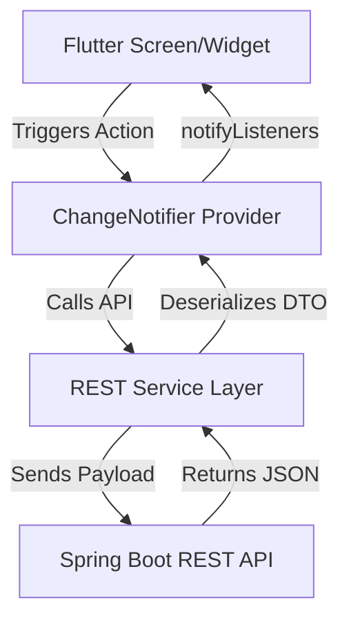
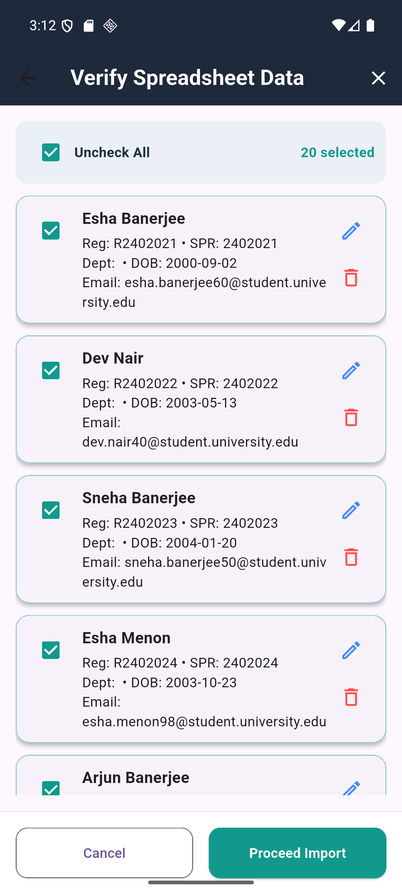

# Student Performance & Discipline Monitoring System (SPDMS) - Flutter Mobile Application
> **Modern, Premium Flutter Mobile Application for Real-Time Performance Analytics, Discipline Logs, and Academic Leaderboard Tracking.**

[](https://flutter.dev)
[](https://dart.dev)
[](https://flutter.dev)
[](https://pub.dev/packages/provider)
[](LICENSE)

---

## 📖 Table of Contents

- [Project Overview](#-project-overview)
- [Key Features](#-key-features)
- [Application Screens](#-application-screens)
- [Flutter Folder Structure](#-flutter-folder-structure)
- [Packages & Dependencies](#-packages--dependencies)
- [State Management Architecture](#-state-management-architecture)
- [API Integration & Token Management](#-api-integration--token-management)
- [Running the Project](#-running-the-project)
  - [Connecting to Spring Boot Backend](#connecting-to-spring-boot-backend)
  - [Run Instructions](#run-instructions)
- [Building the APK](#-building-the-apk)
- [Screenshots & UI Showcase](#-screenshots--ui-showcase)
- [Future Scope](#-future-scope)
- [Contributors](#-contributors)
- [License](#-license)

---

## 🌟 Project Overview

**SPDMS Mobile App** is a high-performance cross-platform Flutter application tailored to give students, teachers, and admins mobile access to the points monitoring system. 

Students can trace their individual progress history, achievements, and infractions, and check their standing in their department leaderboard. Teachers and Admins can log in to search records, add students, and register achievements/violations.

---

## ✨ Key Features

| Target Role | Screen/Feature | Functionality |
| :--- | :--- | :--- |
| **All Roles** | 🔒 **Secure Auth** | Stateless JWT Login with auto-refresh and secure persistent sessions. |
| **Students** | 🏆 **My Scoreboard** | Real-time score monitoring starting from 0 points baseline. |
| **Students** | 📈 **History Tracker** | Categorized list of all reward achievements and point infractions. |
| **Faculty / Admin** | 🔍 **Student Lookup** | Dynamic search of students by name, email, or Roll ID. |
| **Faculty / Admin** | ✏️ **Record Logs** | Immediate point adjustments (reward positive activities, deduct infractions). |

---

## 📱 Application Screens

### 🎬 1. Splash Screen
The entry point of the application. It initializes dependencies, reads secure local storage, and executes auto-login if a valid JWT token is found, redirecting users directly to their corresponding dashboards.

### 🔑 2. Login Screen
A unified, responsive gatekeeper offering distinct login paths:
*   **Teacher / Admin Login:** Form for standard credentials (username, password).
*   **Student Login:** Form accepting Student Roll ID or Email and password.
Supports visual input validations and smooth loading indicators.

### 📊 3. Dashboard Screen
Tailored dashboard experiences based on authentication roles:
*   **Student Dashboard:** Carousel showing summary metrics, point balance, recent notifications, and quick tab-routing buttons.
*   **Teacher/HOD Dashboard:** Quick access to student lists, pending points requests, and departmental summary statistics.

### 👤 4. Student Profile Screen
Displays comprehensive information including Name, Year/Semester, Department details, Contact information, Guardian details, and current score metrics.

### 🏆 5. Leaderboard Screen
Lists top performing students sorted in descending order of their positive points balance. Includes department-based filtering.

### 🥇 6. Achievements Tab
Details positive achievements (Workshops, Hackathons, Internships, Academics, Sports) with badges indicating point rewards.

### ⚠️ 7. Violations Tab
Lists disciplinary infractions (Late attendance, Mobile usage, Dress code violations) indicating the corresponding negative point deductions.

### 📝 8. Reports Screen
Generates visual performance summaries, points histories, and download links for transcripts/reports.

---

## 📂 Flutter Folder Structure

The application architecture follows a highly modular, clean design separation under the `lib/` directory:

```text
lib/
├── main.dart                      # App initialization & routing setup
├── admin/                         # Modular features for Admin Users
│   └── activity/                  # Admin Activity Management sub-module
│       ├── models/
│       ├── pages/
│       ├── providers/
│       ├── repository/
│       ├── services/
│       ├── utils/
│       └── widgets/
├── screens/                       # Presentation layer categorized by roles
│   ├── login/                     # Login screens (Student, Faculty)
│   │   └── login_page.dart
│   ├── student/                   # Student Views
│   │   ├── student_dashboard_page.dart
│   │   └── tabs/                  # Dashboard Tabs (Activities, Leaderboard, Profile)
│   │       ├── activities_tab.dart
│   │       ├── dashboard_tab.dart
│   │       ├── leaderboard_tab.dart
│   │       └── profile_tab.dart
│   └── teacher/                   # Teacher/Faculty Views
│       ├── tabs/                  # Students lookup, removing requests, performance charts
│       ├── teacher_dashboard.dart
│       └── teacher_student_detail.dart
├── widgets/                       # Reusable Custom Components (Buttons, Dialogs, Loading bars)
├── models/                        # Object data mapping (Student, User, DisciplineLog models)
│   └── student.dart
├── services/                      # REST API communication Layer
│   └── student_service.dart
├── utils/                         # Global helper methods, validators, and formatters
├── routes/                        # Application routing parameters
└── constants/                     # Central color schemas, typography styles, and asset directories
```

---

## 📦 Packages & Dependencies

Below are the primary packages utilized in this project:

| Package | Purpose |
| :--- | :--- |
| [`http`](https://pub.dev/packages/http) | Consumes REST API endpoints from the Spring Boot backend. |
| [`provider`](https://pub.dev/packages/provider) | Core State Management solution for local app updates and context. |
| [`shared_preferences`](https://pub.dev/packages/shared_preferences) | Stores lightweight persistent key-value pairs (e.g. user settings). |
| [`flutter_secure_storage`](https://pub.dev/packages/flutter_secure_storage) | Encrypted keychain/keystore storage for sensitive tokens (JWT). |

---

## 🧠 State Management Architecture

The project implements **Provider** as its core state management solution to ensure highly responsive, decoupled UI rendering.



### State Management Flow:
1. **Providers (`ChangeNotifier`)** manage application states (e.g., `AuthProvider`, `StudentProvider`).
2. The UI listens to these states using `Consumer` or `context.watch<T>()`.
3. When actions occur (e.g. log in, adjust points), the Provider executes corresponding calls via the Service layer, changes local state, and calls `notifyListeners()`.
4. The widgets rebuild automatically with smooth transition animations.

---

## 🔌 API Integration & Token Management

All remote calls use the `http` package routed through a middleware utility. 

*   **API Base URL Setup:**
    Configure the network configuration in `lib/constants/api_constants.dart`:
    ```dart
    class ApiConstants {
      static const String baseUrl = 'http://10.0.2.2:8080/api/v1'; // Default Android Emulator loopback
    }
    ```

*   **JWT Authorization Interception:**
    Every protected API call retrieves the token securely stored in `flutter_secure_storage` and appends it to the header:
    ```dart
    final String? token = await secureStorage.read(key: 'jwt_token');
    final response = await http.get(
      Uri.parse('$baseUrl/students'),
      headers: {
        'Content-Type': 'application/json',
        'Authorization': 'Bearer $token',
      },
    );
    ```

---

## 🚀 Running the Project

### Connecting to Spring Boot Backend

> [!IMPORTANT]
> If testing on local machines, make sure your device can communicate with the backend.

*   **Android Emulator:** Use base URL `http://10.0.2.2:8080` (special loopback mapping to localhost).
*   **iOS Simulator:** Use base URL `http://localhost:8080`.
*   **Physical Android/iOS Device:** Configure the backend server to bind to your local Wi-Fi IP (e.g. `http://192.168.1.15:8080`) and ensure both the computer and device are connected to the same wireless network.

### Run Instructions

1.  Clone the repository and navigate to the frontend folder:
    ```bash
    cd Discipline_Monitor_Frontend
    ```
2.  Install dependencies:
    ```bash
    flutter pub get
    ```
3.  Check connected devices:
    ```bash
    flutter devices
    ```
4.  Run in Debug mode:
    ```bash
    flutter run
    ```

---

## 📦 Building the APK

To generate a release build (APK) for Android devices:

```bash
flutter build apk --release
```

The compiled release APK will be saved at:
`build/app/outputs/flutter-apk/app-release.apk`

> [!TIP]
> You can build an App Bundle (AAB) for Google Play Console deployment by running `flutter build appbundle`.

---

## 🖼️ Screenshots & UI Showcase

*Placeholders for upcoming application screens:*

| Launch & Session | Authentication | Profile & Analytics |
| :---: | :---: | :---: |
|  |  |  |

---

## 🔮 Future Scope
- [ ] **Biometric Login:** Integration with FaceID and fingerprint scanner APIs.
- [ ] **Offline Sync:** Local caching of dashboard details to enable offline reading.
- [ ] **Detailed Analytics Charts:** Custom charts showcasing department-wide achievements trends over time.

---

## 👥 Contributors
- **Venkatesan** ([@Venkatesan-2007](https://github.com/Venkatesan-2007)) - Lead Mobile Architect / Maintainer

---

## 📄 License
This project is licensed under the MIT License - see the [LICENSE](LICENSE) file for details.
